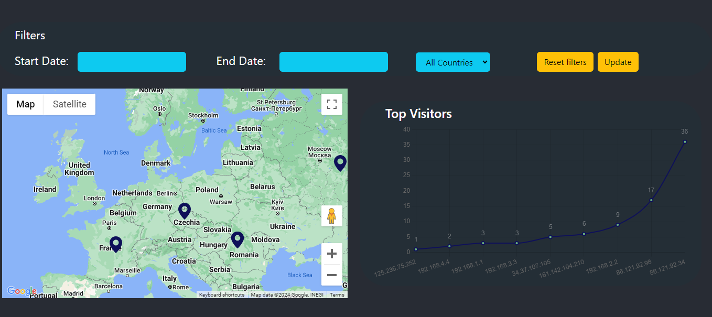

# Skyqraft Full Stack Engineer Coding Test

## Visualizing the origin of visitors of your website

## Introduction

This is a coding test for the position of Full Stack Engineer at Skyqraft. The test is divided into two parts: a frontend part and a backend part. The frontend part is to be done in React and the backend part is to be done in (preferrably) Python. The test is expected to take approximately 4 hours to complete.

> We have designed this test in a way that would be as fun as possible, and give you the ability to host it and showcase on your github profile in the future. We hope you enjoy it!

## Instructions

1. Download this repository. Do not fork the repo. A forked repo is visible for other applicants and we want to avoid that.
2. Complete the test.
3. Send a link to your repository containing your solution to [Andree Hultgren](mailto:andree.hultgren@skyqraft.com) when you are done.

## Frontend

> The frontend should be built using React.

The frontend part of the test is to build a web application that records the visitors GPS location and displays a map of the world where each visitor is coming from. How you display the map is up to you. We recommend using [Google Maps API](https://developers.google.com/maps), since it's well documented and also the tech we use internally. However, you are free to use any map API you want.

The location of the user should not be by using the Browser's built-in API, but rather to use the IP address of the one accessing the website.

## Backend

> The backend should be built using Flask(Python) or Express(JavaScript).

The backend is the service that finds the IP of the user, finds the geospatial location of the IP and stores the data in a database.

The frontend should then be able to fetch the data from the backend and display it on the map.

What data you store in the database is up to you.

### Figuring out the IP of a request

When running locally, the request IP will be a local IP address. This local IP won't help you pinpoint the origin of the request.

When running locally, you should check the IP of the local machine to know where the user's request is coming from. This can be done by using the following API: https://api.ipify.org.

```python
endpoint = 'https://api.ipify.org'
response = requests.get(endpoint)
ip = response.text
```

When running on a hosted server, the request IP will be the IP of the user. This IP can be accessed from the request object.

```python
ip = request.remote_addr
```

### Finding the geospatial location of an IP

You can use the open API [ip-api](https://ip-api.com) to find the geospatial location of an IP. The API is free, well documented and easy to use.

```python
endpoint = 'http://ip-api.com/json/{}'.format(ip)
response = requests.get(endpoint)
data = response.json()
```

### Populating the database

You can test and validate your application in multiple ways.

1. You can use a VPN to change your IP address and see if the map updates accordingly.
2. You can use a proxy server to change your IP address and see if the map updates accordingly.
3. You can populate the database with fake data.
4. You can host the application on a server and go on a roadtrip. (This is the most fun way, but also the most time consuming)

## Database

> The database can be any database you want.

We recommend using a file-based database like [SQLite](https://www.sqlite.org/index.html) for simplicity. However, you are free to use any database you want.

## Bonus

The following is not required but will be considered a bonus:

- More visualized of the visitors of your website
- A way to filter the visitors by date
- A way to filter the visitors by country
- Unit tests
- Dockerfiles for containerization
- A way to deploy the application to a cloud provider

## Questions

If you have any questions about the test, please contact [Andree Hultgren](mailto:andree.hultgren@skyqraft.com).

## Evaluation

The test will be evaluated on the following criteria:

- Code quality
- Code readability
- Code maintainability
- Code performance
- Code structure

## Good luck!

_______

## Solution

-   I implemented the frontend and the backend to get the IP of the visitors and store it in the database with the geospacial-location (country && coordonates) and register every date of the visits. 
-   I created the posibility to filter the visitors by date and by country.
-   I implemented a graph to show top 10 most active visitors o the websit.
-   I implemented unit test for the backend, the frontend it was tested manually.
-   I populated the database with fake data, but also I tested if my actual ip address is registered in real time.
-   I used Google Maps API
-   The backend is implemented in Flask and the frontend in React.

## Requirements to run the backend:

1.  Create and start environment
2.  Install requests by running $ pip install requests.
3.  Init database by running $ flask --app flaskr init-db.
4.  Populate the database with fake data by running $ flask --app flaskr seed-fake-data.
5.  Start debug server by running $ flask --app flaskr run --debug.

## Requirements to run backend unit tests:

1.  Start environment.
2.  Install pytest by running $ pip install pytest coverage.
3.  Start tests by running $ pytest.

## Backend Unit Tests results:


## Requirement to run frontend:

1.  Install dependencies.
2.  Start webapp by running npm start.

## UI Design:


## Fronted Tests:

-   I tested manually all the frontend functionalities. 